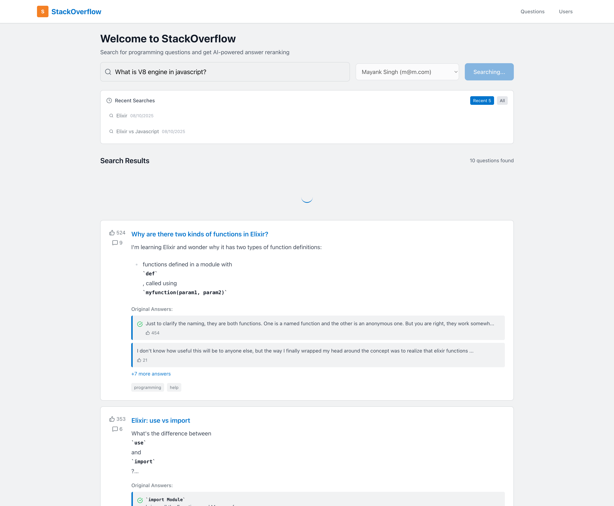
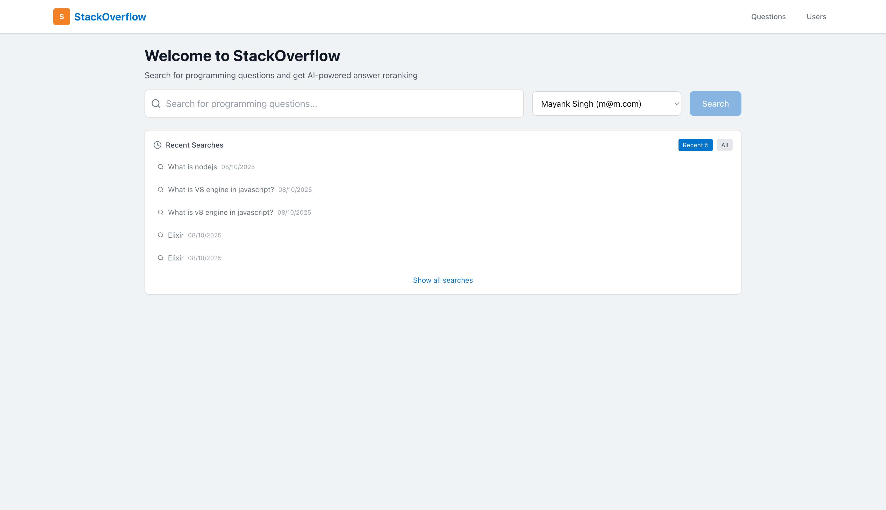
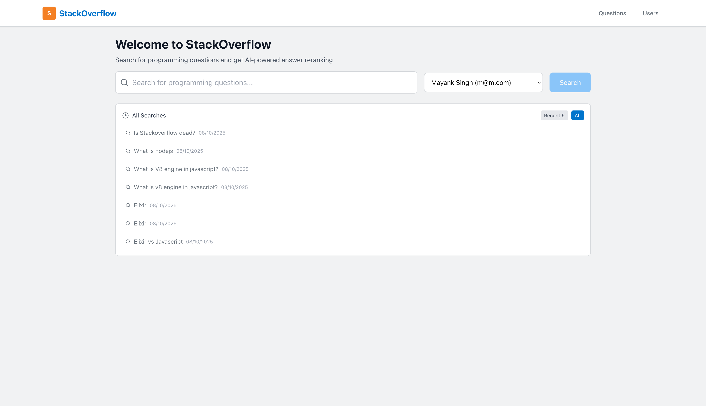
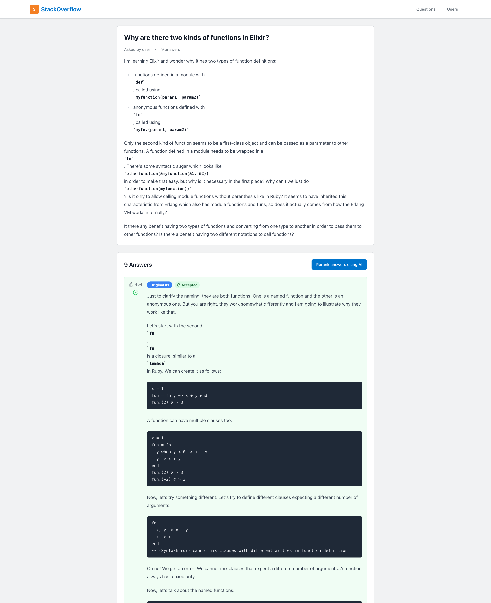
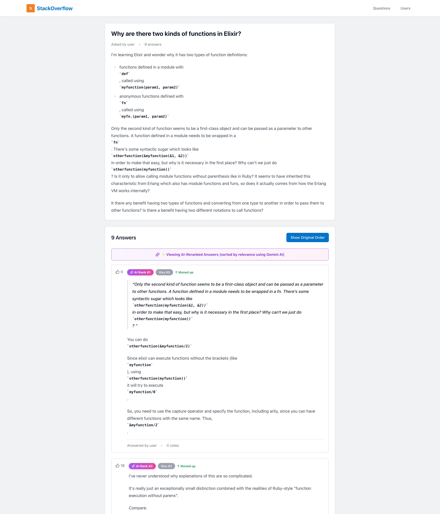
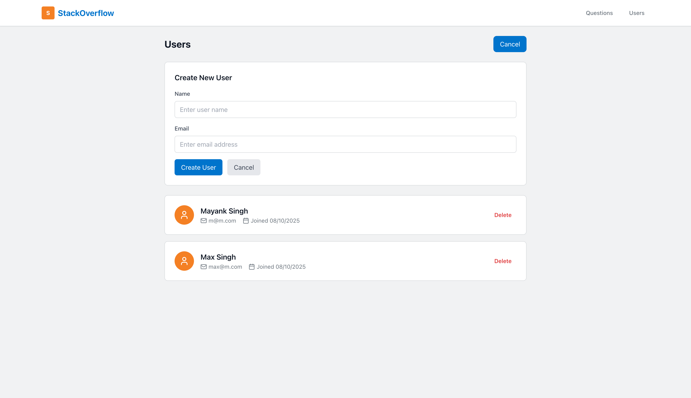
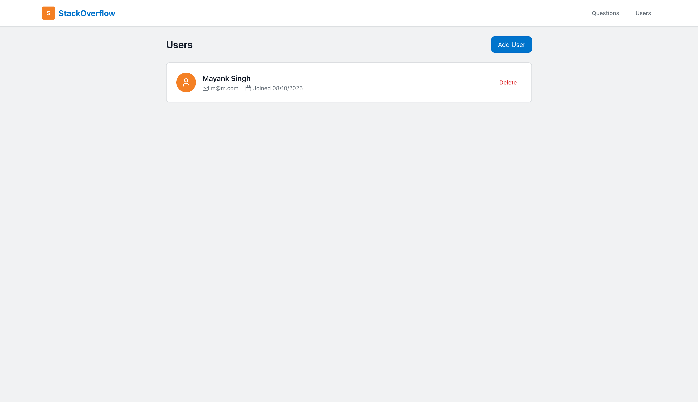
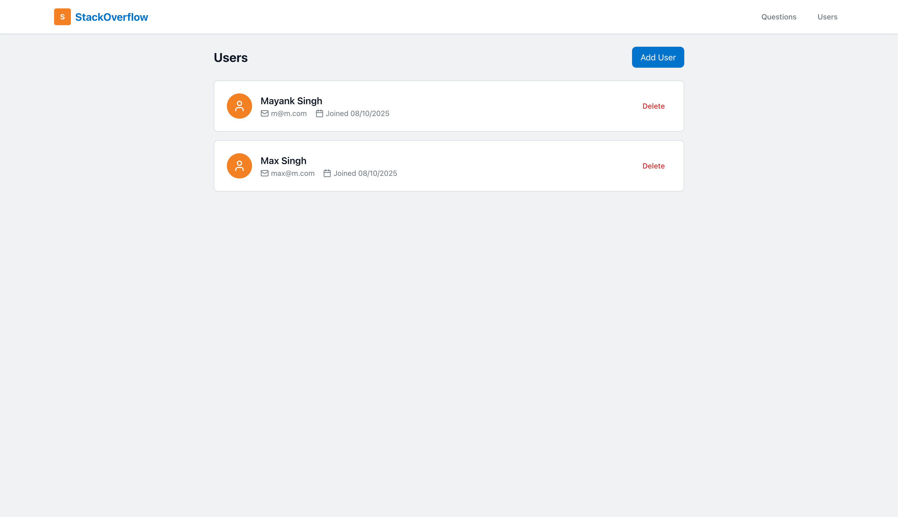

# Stack Overflow Clone - Full Stack Application

Stack Overflow clone built with Elixir/Phoenix backend and React frontend, featuring AI-powered answer reranking using Google Gemini API.

> **⚠️ NOTE:**  
> To use the product effectively, consider creating a user first using the **User Management** page.  
> For a better understanding, refer to the screenshots below.

## Features

### Backend (Elixir/Phoenix)
- **RESTful API** with comprehensive endpoints
- **Stack Overflow API Integration** for real question data
- **AI-Powered Reranking** using Google Gemini API
- **User Management** with PostgreSQL
- **Search History Caching** using Eralng Term Storage (ETS)
- **Error Handling** with proper HTTP status codes

### Frontend (React/TypeScript)
- **Modern React 18** with TypeScript
- **Stack Overflow-Inspired UI** with Tailwind CSS
- **Real-time Search** with loading states
- **AI Reranking Toggle** for enhanced results
- **User Management** interface
- **Recent Searches** component to toggle between recent searches (via cache) & all searches (via database)

### AI Integration
- **Google Gemini API** for answer reranking
- **Toggle Between Original and Reranked** results

## Architecture

```
┌─────────────────┐    ┌─────────────────┐    ┌─────────────────┐
│   React Frontend│    │  Phoenix Backend│    │  PostgreSQL DB │
│   (Port 3000)   │◄──►│   (Port 4000)   │◄──►│   (Port 5432)  │
└─────────────────┘    └─────────────────┘    └─────────────────┘
                              │
                              ▼
                       ┌─────────────────┐
                       │  Stack Overflow │
                       │      API        │
                       └─────────────────┘
                              │
                              ▼
                       ┌─────────────────┐
                       │  Google Gemini  │
                       │      API        │
                       └─────────────────┘
```

## Tech Stack

### Backend
- **Elixir 1.15+** with Phoenix 1.8
- **PostgreSQL** for data persistence
- **HTTPoison** for HTTP requests
- **Gemini API** for AI reranking
- **ETS** for in-memory caching
- **Jason** for JSON handling

### Frontend
- **React 18** with TypeScript
- **Tailwind CSS** for styling
- **React Router** for navigation
- **Axios** for API communication
- **Lucide React** for icons
- **React Markdown** for content

## Quick Start

### Prerequisites
- Elixir 1.15+ and Erlang/OTP 28+
- Node.js 18+
- PostgreSQL 12+
- Google Gemini API key

### Option 1: Docker (Recommended)

1. **Clone the repository**:
   ```bash
   git clone <repository-url>
   cd insights
   ```

2. **Set up environment variables**:
   
   Create a `.env` file in the root directory:
   ```bash
   # Create .env file
   cat > .env << EOF
   # Google Gemini API Key (required for AI answer reranking)
   # Get your API key from: https://aistudio.google.com/app/apikey
   GEMINI_API_KEY=your_actual_gemini_api_key_here
   EOF
   ```
   
   **Important**: Replace `your_actual_gemini_api_key_here` with your actual Gemini API key.
   
   To get a Gemini API key:
   - Visit https://aistudio.google.com/app/apikey
   - Sign in with your Google account
   - Click "Create API Key"
   - Copy the generated key and paste it in your `.env` file

3. **Start all services**:
   ```bash
   docker-compose up --build
   ```

4. **Access the application**:
   - Frontend: http://localhost:3000
   - Backend API: http://localhost:4000
   - Database: localhost:5432

5. **Stop services**:
   ```bash
   docker-compose down
   ```

### Option 2: Manual Setup

#### Backend Setup

1. **Navigate to backend directory**:
   ```bash
   cd stack_overflow_backend
   ```

2. **Install dependencies**:
   ```bash
   mix deps.get
   ```

3. **Set up database**:
   ```bash
   mix ecto.create
   mix ecto.migrate
   ```

4. **Set environment variables**:
   ```bash
   cp env.example .env
   # Add your GEMINI_API_KEY to .env
   ```

5. **Start the server**:
   ```bash
   mix phx.server
   ```

#### Frontend Setup

1. **Navigate to frontend directory**:
   ```bash
   cd stack_overflow_frontend
   ```

2. **Install dependencies**:
   ```bash
   npm install
   ```

3. **Set environment variables**:
   ```bash
   echo "REACT_APP_API_URL=http://localhost:4000/api" > .env
   ```

4. **Start the development server**:
   ```bash
   npm start
   ```

## API Documentation

### User Management

#### Create User
```http
POST /api/users
Content-Type: application/json

{
  "user": {
    "email": "user@example.com",
    "name": "John Doe"
  }
}
```

#### Get All Users
```http
GET /api/users
```

#### Get User by ID
```http
GET /api/users/:id
```

### Question Search

#### Search Questions
```http
GET /api/questions/search?q=elixir&user_id=1&rerank=true
```

**Parameters:**
- `q` (required): Search query
- `user_id` (optional): User ID for search history
- `rerank` (optional): Enable AI reranking

#### Get Specific Question
```http
GET /api/questions/:id
```

#### Get Recent Searches
```http
GET /api/questions/recent-searches?user_id=1
```

## Frontend Features

### Search Interface
- Clean, Stack Overflow-inspired design
- Real-time search with loading states
- AI reranking toggle
- Recent searches component

### Question Display
- Dedicated question cards
- Answer previews with vote counts (fetched from stack overflow)
- Toggle between original and reranked answers
- Markdown / HTML / Rich Content rendering.

### User Management
- Create new users
- View user list
- Delete users

## Configuration

### Environment Variables

#### Root Directory (.env) - For Docker Compose
Create a `.env` file in the project root directory:
```bash
# Google Gemini API Key (required for AI answer reranking)
# Get your API key from: https://aistudio.google.com/app/apikey
GEMINI_API_KEY=your_actual_gemini_api_key_here
```

**Note**: The `.env` file is automatically excluded from version control via `.gitignore`. Never commit your API keys!

#### Backend (.env) - For Manual Setup
If running the backend manually (without Docker), create `.env` in `stack_overflow_backend/`:
```bash
GEMINI_API_KEY=your-gemini-api-key-here
```

#### Frontend (.env) - For Manual Setup
If running the frontend manually (without Docker), create `.env` in `stack_overflow_frontend/`:
```bash
REACT_APP_API_URL=http://localhost:4000/api
```

### Database Configuration
The database is configured in `stack_overflow_clone/config/dev.exs`:
```elixir
config :stack_overflow_clone, StackOverflowClone.Repo,
  username: "postgres",
  password: "postgres",
  hostname: "localhost",
  database: "stack_overflow_clone_dev"
```

## 🧪 Testing

### Backend Tests
```bash
cd stack_overflow_clone
mix test
```

## Deployment

### Docker Deployment
```bash
# Build and start all services
docker-compose up -d

# View logs
docker-compose logs -f

# Stop services
docker-compose down
```

## Troubleshooting

### Common Issues

1. **Database Connection Issues**:
   - Ensure PostgreSQL is running
   - Check database credentials
   - Run `mix ecto.create` and `mix ecto.migrate`

2. **API Connection Issues**:
   - Verify backend is running on port 4000
   - Check CORS configuration
   - Verify API endpoints

3. **Gemini API Issues**:
   - Ensure API key is set correctly
   - Check API quota and limits
   - Verify network connectivity

### Getting Help
- Check the logs: `docker-compose logs`
- Verify environment variables
- Test API endpoints manually (using postman collection as shared in the backend directory)
- Check browser console for frontend errors

## Security Best Practices

### API Key Management

1. **Never commit API keys** to version control
   - The `.env` file is automatically ignored by `.gitignore`
   - Use environment variables for all sensitive data

2. **For Docker deployments**:
   - Create a `.env` file in the project root
   - Docker Compose automatically loads variables from `.env`
   - Example: `GEMINI_API_KEY=your_key_here`

3. **For production deployments**:
   - Use secure environment variable management (AWS Secrets Manager, etc.)
   - Rotate API keys periodically
   - Monitor API usage for anomalies

4. **Getting a Gemini API Key**:
   - Visit: https://aistudio.google.com/app/apikey
   - Sign in with Google account
   - Create and copy your API key
   - Add it to your `.env` file

## Future Enhancements

- [ ] User authentication and authorization
- [ ] Advanced search filters
- [ ] Tag-based organization
- [ ] Mobile app support
- [ ] Performance optimizations
- [ ] Advanced AI features

## Screenshots

### Homepage




### Question Page



### User Management


